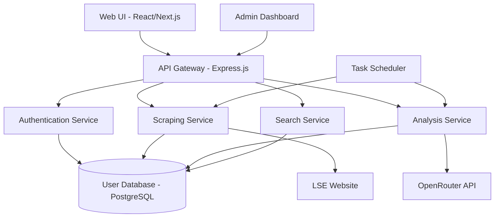

# Design Document

## Overview

The LSE News Scraper is a full-stack web application that automates the collection and analysis of London Stock Exchange news articles. The system consists of a web scraping service, AI analysis pipeline, web-based user interface, and administrative dashboard. The architecture follows a microservices pattern with clear separation between scraping, analysis, and presentation layers.

## Architecture

The system uses a modern web stack with the following high-level architecture:



### Technology Stack

- **Frontend**: React with Next.js for server-side rendering and routing
- **Backend**: Node.js with Express.js API framework
- **Database**: PostgreSQL for structured data with full-text search capabilities
- **Authentication**: JWT tokens with bcrypt password hashing
- **Task Scheduling**: node-cron for automated scraping
- **Web Scraping**: Puppeteer for dynamic content and Cheerio for HTML parsing
- **PDF Processing**: pdf-parse for text extraction
- **AI Integration**: OpenRouter API client for Gemini Flash integration
- **File Storage**: Local filesystem with organized directory structure

## Components and Interfaces

### 1. Web Scraping Service

**Purpose**: Handles automated collection of LSE news articles and PDF downloads.

**Key Classes**:
- `LSEScraper`: Main scraping orchestrator
- `ArticleParser`: Parses individual article pages
- `PDFDownloader`: Manages PDF file downloads
- `RateLimiter`: Implements request throttling

**Interfaces**:
```typescript
interface ScrapingJob {
  id: string;
  searchTerms: string[];
  dateRange: DateRange;
  status: 'pending' | 'running' | 'completed' | 'failed';
  articlesFound: number;
  createdAt: Date;
}

interface ScrapedArticle {
  id: string;
  title: string;
  url: string;
  content: string;
  publishDate: Date;
  company?: string;
  pdfUrls: string[];
  rawHtml: string;
}
```

### 2. AI Analysis Service

**Purpose**: Processes scraped content through OpenRouter/Gemini for keyword detection and summarization.

**Key Classes**:
- `OpenRouterClient`: Handles API communication
- `ContentAnalyzer`: Orchestrates analysis workflow
- `KeywordExtractor`: Identifies target keywords
- `SummaryGenerator`: Creates article summaries

**Interfaces**:
```typescript
interface AnalysisRequest {
  articleId: string;
  content: string;
  pdfTexts: string[];
  targetKeywords: string[];
}

interface AnalysisResult {
  articleId: string;
  keywordsFound: KeywordMatch[];
  summary: string;
  confidence: number;
  processingTime: number;
}

interface KeywordMatch {
  keyword: string;
  occurrences: number;
  context: string[];
  relevanceScore: number;
}
```

### 3. Authentication & User Management

**Purpose**: Handles user registration, login, API key management, and role-based access control.

**Key Classes**:
- `AuthController`: Manages authentication endpoints
- `UserService`: User CRUD operations
- `APIKeyManager`: Encrypts and manages OpenRouter keys
- `RoleManager`: Handles permission checking

**Interfaces**:
```typescript
interface User {
  id: string;
  email: string;
  passwordHash: string;
  role: 'admin' | 'user';
  openRouterApiKey?: string;
  isActive: boolean;
  createdAt: Date;
  lastLogin?: Date;
}

interface AuthToken {
  userId: string;
  email: string;
  role: string;
  exp: number;
}
```

### 4. Search & Query Service

**Purpose**: Provides fast, filtered search across analyzed articles with full-text capabilities.

**Key Classes**:
- `SearchController`: Handles search API endpoints
- `QueryBuilder`: Constructs database queries
- `ResultFormatter`: Formats search results for UI

**Interfaces**:
```typescript
interface SearchQuery {
  keywords?: string[];
  dateRange?: DateRange;
  companies?: string[];
  hasKeywordMatches?: boolean;
  limit: number;
  offset: number;
}

interface SearchResult {
  articles: ArticleSummary[];
  totalCount: number;
  facets: SearchFacets;
}
```

### 5. Web UI Components

**Purpose**: React-based user interface for search, article viewing, and account management.

**Key Components**:
- `SearchForm`: Advanced search interface
- `ArticleList`: Displays search results
- `ArticleDetail`: Full article view with PDF links
- `UserSettings`: API key and preference management
- `AdminDashboard`: User management and system monitoring

## Data Models

### Database Schema

```sql
-- Users table
CREATE TABLE users (
    id UUID PRIMARY KEY DEFAULT gen_random_uuid(),
    email VARCHAR(255) UNIQUE NOT NULL,
    password_hash VARCHAR(255) NOT NULL,
    role VARCHAR(20) DEFAULT 'user',
    openrouter_api_key_encrypted TEXT,
    is_active BOOLEAN DEFAULT true,
    created_at TIMESTAMP DEFAULT NOW(),
    last_login TIMESTAMP
);

-- Articles table
CREATE TABLE articles (
    id UUID PRIMARY KEY DEFAULT gen_random_uuid(),
    title TEXT NOT NULL,
    url VARCHAR(500) UNIQUE NOT NULL,
    content TEXT,
    publish_date TIMESTAMP,
    company VARCHAR(255),
    raw_html TEXT,
    created_at TIMESTAMP DEFAULT NOW(),
    updated_at TIMESTAMP DEFAULT NOW()
);

-- Article analysis results
CREATE TABLE article_analyses (
    id UUID PRIMARY KEY DEFAULT gen_random_uuid(),
    article_id UUID REFERENCES articles(id),
    keywords_found JSONB,
    summary TEXT,
    confidence DECIMAL(3,2),
    processing_time INTEGER,
    analyzed_at TIMESTAMP DEFAULT NOW()
);

-- PDF attachments
CREATE TABLE article_pdfs (
    id UUID PRIMARY KEY DEFAULT gen_random_uuid(),
    article_id UUID REFERENCES articles(id),
    filename VARCHAR(255),
    file_path VARCHAR(500),
    file_size INTEGER,
    extracted_text TEXT,
    created_at TIMESTAMP DEFAULT NOW()
);

-- Scraping jobs
CREATE TABLE scraping_jobs (
    id UUID PRIMARY KEY DEFAULT gen_random_uuid(),
    search_terms JSONB,
    date_range JSONB,
    status VARCHAR(20),
    articles_found INTEGER DEFAULT 0,
    error_message TEXT,
    created_at TIMESTAMP DEFAULT NOW(),
    completed_at TIMESTAMP
);

-- User search history
CREATE TABLE search_history (
    id UUID PRIMARY KEY DEFAULT gen_random_uuid(),
    user_id UUID REFERENCES users(id),
    query JSONB,
    results_count INTEGER,
    searched_at TIMESTAMP DEFAULT NOW()
);
```

### Full-Text Search Indexes

```sql
-- Enable full-text search on articles
CREATE INDEX idx_articles_content_fts ON articles USING gin(to_tsvector('english', content));
CREATE INDEX idx_articles_title_fts ON articles USING gin(to_tsvector('english', title));
CREATE INDEX idx_pdf_text_fts ON article_pdfs USING gin(to_tsvector('english', extracted_text));
```

## Error Handling

### Scraping Error Handling

1. **Rate Limiting**: Implement exponential backoff when LSE returns 429 status
2. **Network Failures**: Retry failed requests up to 3 times with increasing delays
3. **Parsing Errors**: Log failed articles but continue processing remaining items
4. **PDF Download Failures**: Mark PDFs as failed but don't block article processing

### AI Analysis Error Handling

1. **API Key Validation**: Check OpenRouter key validity before processing
2. **Rate Limit Handling**: Queue analysis requests when hitting API limits
3. **Content Size Limits**: Split large documents into chunks for processing
4. **Timeout Handling**: Set reasonable timeouts and retry failed analyses

### User Interface Error Handling

1. **Authentication Errors**: Clear invalid tokens and redirect to login
2. **Search Errors**: Display user-friendly error messages for failed searches
3. **File Upload Errors**: Validate file types and sizes before processing
4. **Network Errors**: Implement retry mechanisms for failed API calls

## Testing Strategy

### Unit Testing

- **Scraping Components**: Mock LSE website responses and test parsing logic
- **AI Integration**: Mock OpenRouter API responses and test analysis workflows
- **Database Operations**: Use test database with sample data for CRUD operations
- **Authentication**: Test JWT generation, validation, and role-based access

### Integration Testing

- **API Endpoints**: Test complete request/response cycles for all endpoints
- **Database Integration**: Test complex queries and data relationships
- **External Services**: Test OpenRouter integration with real API calls (limited)
- **File Operations**: Test PDF download and text extraction workflows

### End-to-End Testing

- **User Workflows**: Test complete user journeys from registration to article search
- **Admin Functions**: Test user management and system monitoring features
- **Scraping Pipeline**: Test full scraping and analysis workflow with sample data
- **Error Scenarios**: Test system behavior under various failure conditions

### Performance Testing

- **Database Queries**: Test search performance with large datasets
- **Concurrent Users**: Test system behavior under multiple simultaneous users
- **Scraping Load**: Test system stability during intensive scraping operations
- **Memory Usage**: Monitor memory consumption during PDF processing and AI analysis